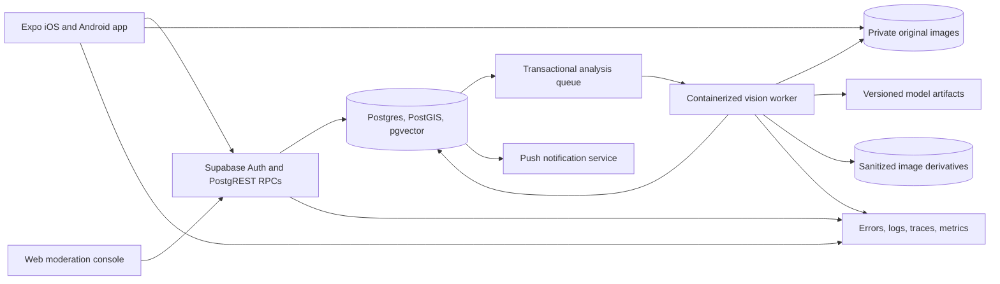

# CatMap Production Roadmap

## Mission

Build a trustworthy mobile network for recording outdoor-cat sightings and
reuniting missing cats with their owners. CatMap should feel fast and playful,
but location privacy, animal welfare, abuse prevention, and honest AI
uncertainty take priority over engagement.

This is the execution plan from the current prototype to a secure, observable,
deployable product. It is deliberately sequenced: each milestone must satisfy
its exit gates before the next milestone becomes release-critical.

## Definition of Production Ready

CatMap is production ready only when all of the following are true:

- a user can install the app, create or recover an account, record a sighting,
  browse privacy-safe nearby sightings, report a missing cat, review possible
  matches, and manage or delete their data;
- exact locations and original images are never exposed through public APIs;
- every public write is authenticated, validated, rate-limited, idempotent
  where necessary, and covered by positive and negative authorization tests;
- AI can return `unknown`, never contacts an owner without policy-approved
  confidence and human review, and has measured performance on held-out local
  data;
- abusive content can be reported, hidden, reviewed, appealed, and audited;
- development, staging, and production are isolated and reproducibly deployed;
- releases are signed, tested on real iOS and Android devices, gradually
  rolled out, observable, and reversible;
- backup restoration, incident response, key rotation, account deletion, and
  model rollback have been exercised rather than merely documented;
- App Store privacy disclosures and Google Play Data Safety declarations match
  actual runtime behavior.

## Product and Safety Principles

1. **Coarse by default.** Exact coordinates are owner-only. Shared locations
   use a coarse cell or intentionally vague area, with additional suppression
   near homes and sensitive sites.
2. **Humans confirm identity.** AI retrieves and ranks candidates; it does not
   establish identity or ownership.
3. **Unknown is a valid answer.** Low-quality images, unseen cats, and ambiguous
   markings must result in no suggestion.
4. **No unsafe incentives.** Points must never encourage trespassing,
   approaching, feeding, capturing, or repeatedly tracking an animal.
5. **Minimum necessary data.** Collect only what supports a user-visible
   feature, define its retention period, and delete it when no longer needed.
6. **Reversible delivery.** Risky features ship behind server-controlled flags,
   first to staff, then staging, then a small production cohort.

## Current Baseline

### Already present

- Expo and React Native TypeScript application.
- Anonymous Supabase session bootstrap.
- Private sighting-photo upload and server-side sighting creation.
- Owner-only exact sighting reads and a privacy-safe feed projection.
- Coarse public coordinates and server-side input validation.
- A private, transactionally enqueued analysis-job record for each sighting.
- Hermetic application tests and local pgTAP database security tests.

### Known gaps

- The app is still on Expo SDK 54 and inherits unresolved dependency
  advisories from that toolchain.
- There is no navigation shell, map/feed, account recovery, missing-cat flow,
  notifications, moderation console, or production telemetry.
- The photo pipeline does not yet normalize orientation, remove metadata,
  generate derivatives, or provide safe signed access to shared images.
- Analysis jobs have no leasing worker, retry policy, dead-letter workflow,
  model output schema, or operational dashboard.
- No model has been selected or proven on CatMap data.
- There are no isolated staging/production environments or automated release
  workflows.

## Target Architecture

### Runtime boundaries

- **Mobile app:** capture, offline drafts, upload orchestration, map/feed,
  owner workflows, accessibility, localization, and push handling. It receives
  no service credentials and performs no authoritative scoring.
- **Supabase:** identity, authorization, transactional product data, spatial
  queries, vector candidate retrieval, private storage, audit records, and
  durable job state.
- **Vision worker:** a separately deployable CPU/GPU container. It uses a
  narrowly scoped server credential, leases jobs, creates sanitized
  derivatives, runs models, records versioned outputs, and has no public
  endpoint unless a later ADR proves one is required.
- **Moderation console:** a separate least-privilege application with staff
  roles, step-up authentication, reason codes, and immutable audit events.

## Delivery Milestones

### M0 — Repository and platform baseline

Goal: make every future change reproducible and prevent known platform drift.

- Upgrade Expo one supported SDK at a time to the current stable release.
- Adopt Expo Router with typed routes and explicit authenticated, onboarding,
  and modal route groups.
- Select and document state boundaries: server state, local UI state, durable
  offline drafts, and authentication state must not share an ad hoc store.
- Add a validated environment module that fails fast when required public
  configuration is missing and rejects server-only variable names.
- Add GitHub Actions for formatting, linting, TypeScript, unit tests, database
  reset/tests, Expo Doctor, secret scanning, and dependency review.
- Enable Dependabot or Renovate with grouped Expo-compatible updates.
- Add pull-request templates, CODEOWNERS, protected main, required checks, and
  conventional release notes.
- Produce a dependency ADR before adding runtime libraries. Initial shortlist:
  Expo Router, TanStack Query, Expo Image, Expo SecureStore, Expo
  Notifications, an accessible map library, and Sentry.

Exit gates:

- Expo Doctor passes on a clean install.
- CI reproduces every local check without credentials or external API calls.
- No critical known vulnerability is accepted without a documented owner,
  exposure analysis, mitigation, and deadline.
- A development build runs on at least one physical iOS device and one physical
  Android device.

### M1 — Identity, consent, and account lifecycle

Goal: replace fragile anonymous-only identity with a recoverable user journey
without losing existing sightings.

- Keep anonymous onboarding for a low-friction first sighting.
- Offer account upgrade through email magic link and platform-native sign-in.
- Link the upgraded identity to the existing profile transactionally.
- Store refresh credentials through a SecureStore-backed adapter and document
  device-loss and session-revocation behavior.
- Add age/eligibility decision, terms and privacy acknowledgement, analytics
  consent, notification consent, and precise-location education at the moment
  each permission is needed.
- Implement profile export, sign-out, revoke-all-sessions, and verified account
  deletion with a background erasure job.
- Add blocked-user controls before any direct social interaction ships.

Exit gates:

- Account upgrade, recovery, deletion, and anonymous-to-account migration have
  end-to-end tests.
- Revoked and deleted users cannot read, write, refresh, or receive pushes.
- The privacy policy describes every collected field, processor, purpose, and
  retention period.

### M2 — Complete trustworthy core product

Goal: deliver the full manual recovery loop before using AI to influence users.

- Navigation shell, onboarding, permission education, settings, accessibility,
  dark mode, and localization framework.
- Camera/library capture with orientation correction, size limits, resumable
  upload, retry, cancellation, and offline draft recovery.
- Nearby feed and map with clustering, pagination, filters, refresh, empty
  states, and coarse-location explanations.
- User-owned sighting history with edit, hide, and delete controls.
- Missing-cat profile: multiple photos, description, last-seen area and time,
  status, contact preferences, and resolved/closed lifecycle.
- Manual possible-match flow with accept, reject, not-sure, duplicate, and
  report actions.
- Privacy-preserving owner contact: in-app relay or masked channel rather than
  exposing phone numbers or email addresses.
- Push notifications with per-category preferences, quiet hours, deep links,
  deduplication, delivery logging, and unsubscribe behavior.
- Useful but safe collection mechanics: badges and streaks must exclude exact
  locations and must not reward risky behavior.

Exit gates:

- A real user can complete the sighting-to-owner-confirmation loop without AI.
- The application remains usable during intermittent connectivity and never
  creates duplicate sightings after retry.
- VoiceOver/TalkBack, dynamic type, contrast, reduced motion, and touch target
  checks pass for every critical flow.

### M3 — Backend, image, and geospatial hardening

Goal: turn the database and storage layer into a narrow, enforceable API.

- Add separate development, staging, and production Supabase projects with no
  shared secrets, buckets, users, or telemetry destinations.
- Move all shared reads and writes behind reviewed RPCs or views with explicit
  projections; keep base tables private by default.
- Add PostGIS for distance queries and policy-aware spatial indexes. Never send
  exact coordinates to a map client that does not own the record.
- Use stable cursor pagination with deterministic tie-breaking.
- Add idempotency keys to uploads, sighting creation, match decisions, pushes,
  and destructive background jobs.
- Normalize every upload in a quarantined worker: verify magic bytes, decode
  with bounded memory/time, correct orientation, strip EXIF, resize, re-encode,
  hash, and generate display/thumbnail derivatives.
- Serve only sanitized derivatives through short-lived signed URLs or an
  authenticated transformation endpoint. Originals remain private and have a
  shorter documented retention period.
- Add per-user, per-device, and per-network rate limits; upload quotas; request
  size limits; abuse heuristics; and replay protection.
- Add queue leasing with `FOR UPDATE SKIP LOCKED`, lease expiry, bounded
  exponential retry, poison-job classification, dead-letter review, and safe
  replay tooling.
- Add append-only security/moderation audit events and database tests that
  attempt cross-user access for every sensitive relation and RPC.

Exit gates:

- The authorization matrix is executable as tests and contains explicit deny
  cases for anonymous, authenticated, owner, moderator, worker, and admin roles.
- Malformed and adversarial images cannot exhaust worker resources or become
  publicly retrievable.
- Queue jobs can be lost, duplicated, timed out, and replayed in tests without
  corrupting product state.

### M4 — AI-assisted cat matching

Goal: provide useful candidate suggestions with calibrated uncertainty and a
safe feedback loop.

#### Data and evaluation first

- Define a versioned consent and data-use policy before creating a training
  dataset.
- Build a de-identified evaluation set with cat identity, capture time,
  neighborhood, image quality, pose, occlusion, coat pattern, and consent
  provenance.
- Split by cat and time so near-duplicate photos cannot leak across train and
  evaluation sets.
- Include same-neighborhood lookalikes, low-light images, kittens as they age,
  partial bodies, multiple cats, non-cat images, screenshots, and unseen cats.
- Maintain a golden safety set that never becomes training data.

#### Inference pipeline

1. Decode and validate the sanitized image.
2. Detect whether a usable cat is present; reject or request a better photo
   when quality is insufficient.
3. Crop or segment the cat while retaining a bounded amount of context.
4. Generate a versioned global embedding.
5. Retrieve a geographically and temporally appropriate top-K set using
   pgvector HNSW plus structured filters.
6. Rerank the small set with local marking/feature correspondence and confirmed
   attributes.
7. Fuse scores with location, time, quality, and evidence availability using a
   calibrated, versioned policy.
8. Return candidates, `insufficient_evidence`, or `unknown` with reason codes.
9. Require owner/moderator confirmation before treating a suggestion as a
   match.

#### Model selection gate

- Benchmark animal-specific re-identification models and modern general visual
  backbones on identical CatMap splits.
- Evaluate detector, embedder, local matcher, and fusion policy independently.
- Reject any model or dataset whose production, hosted-inference, derivative,
  or commercial-use license is unclear.
- Record artifact digest, source, license, training-data statement, preprocessing,
  embedding dimension, quantization, runtime, and evaluation results in a model
  card and registry.
- Prefer a small CPU-capable baseline first. Add GPU inference only when the
  measured latency/cost benefit justifies the operational burden.

#### Required AI metrics

- Recall@1, Recall@5, and Recall@10 for known cats.
- Unknown-cat rejection, false-accept rate, and false owner-alert rate.
- Calibration error and coverage at each confidence threshold.
- Performance sliced by lighting, pose, coat color/pattern, image quality,
  neighborhood density, device class, and time since reference photo.
- End-to-end queue latency, failure rate, compute time, and cost per analyzed
  sighting.

#### Safe rollout

- Offline evaluation only.
- Production shadow mode with no user-visible output.
- Staff/moderator suggestions with captured feedback.
- Small opt-in owner cohort behind a kill switch.
- Gradual rollout only if online precision, complaint rate, and slice metrics
  remain inside approved limits.

Exit gates:

- Thresholds are selected before examining the launch cohort.
- Every visible suggestion identifies the evidence level and permits rejection.
- A one-action kill switch disables suggestions without disabling sightings.
- Rollback to the previous model and reprocessing by model version are tested.

### M5 — Trust, moderation, and abuse resistance

Goal: make public participation safe enough to operate at neighborhood scale.

- Reporting taxonomy for unsafe location, harassment, stolen image, spam,
  graphic content, false ownership, duplicate, and animal-welfare concern.
- Automatic quarantine rules for new/high-risk accounts and repeated uploads.
- Moderator queues with severity, SLA, reason codes, evidence minimization,
  dual control for irreversible actions, and audited access.
- User notice and appeal flow for content and account actions.
- Copyright/takedown process and proof-of-ownership escalation that does not ask
  users to publish sensitive documents.
- Anti-scraping controls, enumeration resistance, signed-media expiry, and
  anomaly alerts for bulk location or image access.
- Emergency playbook for stalking risk, credible threats, leaked coordinates,
  compromised moderator accounts, and harmful AI match bursts.

Exit gates:

- Seeded abuse simulations are detected and handled end to end.
- Moderators can act without direct database access.
- All privileged reads and actions are attributable and reviewed.

### M6 — Observability, reliability, and operations

Goal: know when CatMap is failing and recover without improvisation.

- Mobile crash/error reporting with source maps, release identifiers, privacy
  scrubbing, and environment separation.
- Structured backend/worker logs with correlation IDs, job IDs, model versions,
  and no tokens, raw coordinates, image URLs, or free-text notes.
- Distributed traces across RPC, queue, worker, storage, and push boundaries.
- Product analytics based on privacy-reviewed events and consent, not raw screen
  recordings or precise locations.
- Dashboards for sign-in, upload, create-sighting, feed, missing-cat lifecycle,
  match decisions, push delivery, queue depth/age, AI outcomes, moderation, and
  deletion jobs.
- Initial service objectives: 99.9% successful API availability, 99.8%
  crash-free sessions, p95 non-upload API latency below 500 ms, and p95
  analysis completion below five minutes. Re-baseline with measured traffic.
- Alerts tied to user impact and runbooks, with deduplication and ownership.
- Point-in-time recovery, encrypted backups, restore drills, regional failure
  plan, key rotation, credential compromise, and dependency outage runbooks.

Exit gates:

- A staging game day demonstrates restore, queue recovery, model rollback,
  notification shutdown, and service-credential rotation.
- On-call can identify affected users and safely mitigate each launch-critical
  failure from documented signals.

### M7 — Secure delivery and public launch

Goal: produce signed, policy-compliant releases with controlled exposure.

- EAS development, preview, and production build profiles with distinct bundle
  identifiers, projects, environment variables, and update channels.
- Reproducible native builds, locked Node/npm versions, dependency provenance,
  generated SBOM, secret scanning, and stored release attestations.
- Runtime-version policy that prevents an over-the-air update from crossing an
  incompatible native boundary.
- Internal distribution, TestFlight, and Play closed testing before store
  review.
- Automated smoke tests against staging after backend and mobile deployment.
- Phased store rollout, over-the-air rollout cohorts, server feature flags,
  health gates, kill switches, and rollback instructions.
- App Store privacy labels, Google Play Data Safety form, support URL, privacy
  request channel, incident contact, terms, community rules, and model
  disclosure reviewed against the shipped build.
- External penetration test focused on authorization, media access, location
  inference, account takeover, moderation privilege, and API enumeration.

Exit gates:

- No open launch-blocking findings in the threat model, OWASP MASVS review,
  privacy review, penetration test, or store-compliance checklist.
- Production migration and rollback plans have run successfully on a staging
  copy with production-like volume.
- The launch build has passed a limited real-user beta and a go/no-go review.

### M8 — Post-launch scale and richer features

These are valuable only after the core system is safe, measured, and operated:

- shelters, rescues, veterinarians, and verified community organizations;
- owner-configurable search areas and privacy-preserving neighborhood alerts;
- multilingual missing-cat posters and share cards without tracking pixels or
  exact coordinates;
- collaborative case timelines and trusted helper roles;
- duplicate-case merging and cross-region transfer;
- on-device quality guidance and optional on-device embeddings when supported;
- privacy-preserving aggregate heatmaps with minimum cohort thresholds;
- federated or opt-in improvement research only after independent privacy and
  security review;
- web experience for public coarse sightings and authenticated owner workflows;
- capacity planning, read replicas, partitioning, archival tiers, and regional
  expansion when measured load requires them.

## Data Model Direction

The schema should evolve around explicit lifecycles rather than nullable fields:

- `profiles`, `devices`, `consents`, and `notification_preferences`;
- `sightings`, `sighting_media`, and sanitized `media_derivatives`;
- `cats`, `cat_reference_media`, `missing_cases`, and `case_areas`;
- `match_suggestions`, `match_decisions`, and `match_feedback`;
- `analysis_jobs`, `analysis_runs`, `embeddings`, and `model_versions`;
- `reports`, `moderation_cases`, `moderation_actions`, and `appeals`;
- `audit_events`, `idempotency_keys`, and `deletion_jobs`.

Every lifecycle table needs an allowed-transition matrix, actor authorization,
timestamps, idempotency behavior, retention policy, and tests. Destructive
state should generally be tombstoned first and erased asynchronously according
to policy.

## Security Verification Matrix

Each release must cover:

- **Authentication:** anonymous upgrade, token theft/revocation, account
  recovery, session expiry, deleted and disabled accounts.
- **Authorization:** owner/non-owner, blocked users, moderators, worker,
  service role, cross-tenant identifiers, bulk and nested reads.
- **Storage:** content-type spoofing, decompression bombs, malformed images,
  path traversal, signed URL expiry, derivative/original separation.
- **Location privacy:** RPC projection, logs, analytics, notifications, image
  metadata, map tiles, exports, support tools, and inference from repeated cells.
- **Abuse:** enumeration, scraping, spam, notification floods, report brigading,
  stolen photos, false ownership, and privileged insider access.
- **Supply chain:** lockfile integrity, malicious package scripts, leaked build
  secrets, outdated native SDKs, dependency licenses, and artifact provenance.
- **AI:** data poisoning, prompt-like metadata, adversarial/non-cat images,
  model artifact tampering, embedding extraction, bias, drift, and alert bursts.

Use OWASP MASVS as the mobile baseline and maintain a CatMap-specific threat
model because generic checklists do not cover stalking, animal-welfare, or
identity-matching risk.

## Testing Pyramid

- Pure unit tests for validation, state transitions, score fusion, formatting,
  and privacy transformations.
- React Native component tests for interaction, accessibility, loading, error,
  and offline states.
- Database tests for constraints, RLS, RPC projections, lifecycle transitions,
  queue leasing, idempotency, and migration compatibility.
- Contract tests between the app, generated database types, worker payloads,
  push payloads, and feature-flag configuration.
- Hermetic integration tests with local Supabase and stubbed push/model/storage
  failures.
- Maestro or equivalent critical-path tests on iOS and Android development
  builds.
- Migration tests using anonymized production-shaped volume.
- Load and chaos tests for upload bursts, popular map cells, queue backlog,
  worker loss, storage latency, and push-provider failure.
- Offline model evaluation plus a small fixed end-to-end vision corpus in CI;
  large benchmarks run in a reproducible scheduled pipeline.

No automated test may contact production or a paid external provider.

## Decision Records Required Before Implementation

1. Supported Expo SDK upgrade sequence and New Architecture compatibility.
2. Navigation, server-state, form validation, and offline persistence libraries.
3. Map provider, native library, cost ceiling, attribution, and location privacy.
4. Account providers and anonymous-account upgrade semantics.
5. Sanitized media pipeline and derivative delivery design.
6. Transactional table queue versus a managed PostgreSQL queue extension.
7. Worker hosting, CPU/GPU runtime, regional placement, and autoscaling ceiling.
8. Vector index parameters, embedding dimension, and reindex/migration plan.
9. Model shortlist, licenses, benchmark protocol, thresholds, and model registry.
10. Push provider, relay/contact design, observability, analytics, and feature
    flag services.
11. Retention schedule, deletion semantics, moderation access, and audit storage.
12. Release channels, runtime-version policy, rollback, and incident ownership.

Each record must describe context, options, decision, consequences, security and
privacy impact, operating cost, rollback, and review date.

## Release Gates

### Pull request

- Focused change, reviewed migration and generated types, tests, documentation,
  dependency/license review, and no secret or unrelated lockfile drift.

### Staging

- Clean infrastructure apply, migration backup/restore point, smoke tests,
  synthetic critical journey, telemetry validation, and rollback rehearsal.

### Production

- Explicit go/no-go owner, fresh change plan, approved migrations, phased
  exposure, monitored service objectives, support readiness, and rollback
  authority. A green build is necessary but is not deployment proof.

## Recommended Execution Order

The next commits should stay small even though the destination is ambitious:

1. CI and current Expo SDK upgrade plan.
2. Expo upgrade with no product behavior changes.
3. Navigation shell and environment validation.
4. Account lifecycle schema and anonymous-upgrade characterization tests.
5. Feed/map RPC contract and sanitized media design.
6. Missing-cat and manual-match state machines.
7. Queue leasing and analysis-run schema.
8. Reproducible offline model benchmark harness.
9. Worker baseline in shadow mode.
10. Moderation, telemetry, deployment environments, and staged beta gates.

Do not combine SDK migration, navigation rewrite, data migration, and model
integration in one pull request. Production readiness comes from small,
observable, reversible increments—not from a single large launch branch.

## Primary Standards and Operational References

- [Expo EAS Build](https://docs.expo.dev/build/introduction/),
  [EAS Update](https://docs.expo.dev/eas-update/introduction/), and
  [EAS Submit](https://docs.expo.dev/submit/introduction/)
- [Supabase production checklist](https://supabase.com/docs/guides/deployment/going-into-prod),
  [Row Level Security](https://supabase.com/docs/guides/database/postgres/row-level-security),
  and [pgvector](https://supabase.com/docs/guides/ai/vector-columns)
- [OWASP Mobile Application Security](https://mas.owasp.org/)
- [NIST AI Risk Management Framework](https://www.nist.gov/itl/ai-risk-management-framework)
- [Apple App Privacy Details](https://developer.apple.com/app-store/app-privacy-details/)
  and [Google Play Data Safety](https://support.google.com/googleplay/android-developer/answer/10787469)

These references are baselines, not substitutes for CatMap's own threat model,
model evaluation, privacy review, and operational evidence.
